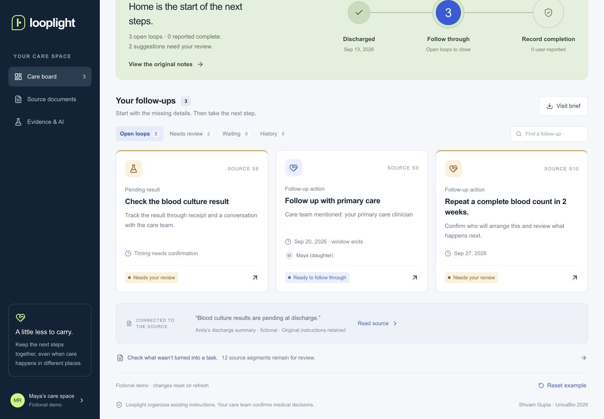

# Looplight

### Give every next step a source, a person and a recorded ending.

**An AI-assisted UnivaBio 2026 project by Shivam Gupta.**

Looplight helps patients, caregivers and care coordinators track unfinished care after hospital discharge: a pending result, a repeat test or a follow-up visit. It suggests actions from the document, preserves the exact source and keeps missing details visible. A result arriving is one step; reported clinician review is recorded separately.

[Open Looplight](https://looplight-care.web.app) · [One-page description](submission/looplight-one-page.pdf) · [Project story](submission/project-story.md) · [Judge testing guide](submission/testing-instructions.md)

> **Scope:** a research MVP for fictional or de-identified notes. It is not clinically validated or ready for identifiable patient records. Status, review and history entries are user-reported. Firebase rules protect account boundaries and storage invariants; they do not provide trusted clinical audit or server-side validation of workflow transitions.



## Try the working demo

1. Open the app without signing in. The fictional Anita/Maya example is ready to explore.
2. Choose **Try the pending-result walkthrough**. Inspect the exact sentence, missing timing and questions for the care team.
3. Enter a tracking person, check the source-review confirmation and choose **Confirm this follow-up**. Leave uncertain timing blank.
4. In **Record progress**, enter a note and choose **Record result received**. The follow-up stays open.
5. Record the fictional clinician who reviewed it, what happened, a completion date and your confirmation. Choose **Record completion**. History labels the result as user-reported.
6. Choose **Save this care space**. Continue with Google or use email/password. This saves a copy of the current source, follow-ups and edits into your account. Refresh the saved space to return to it.

Already signed in and exploring the demo? **Open my saved spaces** returns to existing records without creating a copy. The care-space/account panel offers both **Open my saved spaces** and **Save this care space**.

Use **Add discharge notes → Anita's discharge → Find the open loops** for a fresh import with three suggestions. **Evidence & AI → Try a challenge** fills the conflicting-instructions example for you to inspect before analysis. **Source documents** includes every retained sentence and lets you add a missed follow-up.

Anonymous demo changes and unfinished form drafts live in the current tab's memory. Closing and reopening a form retains its draft. Refreshing or closing the tab loses unsaved work. Use **Save this care space** before leaving if you want to preserve the current plan. Sign-in persistence is handled separately by Firebase Auth.

## Why this problem

Anita is home from hospital. Her daughter Maya has a discharge summary and three unfinished steps. The appointment is easy to notice. The pending culture and repeat blood count also need someone to track them.

A 2005 study of 2,644 patients at two academic hospitals found that 41% had results return after discharge. This is a historical, setting-specific measurement, not a current global rate. Federal SAFER guidance also addresses test-result reporting and follow-up. These sources motivate the workflow; they do not establish Looplight's clinical effectiveness. [Original study](https://pubmed.ncbi.nlm.nih.gov/16027454/) · [SAFER guides](https://healthit.gov/clinical-quality-and-safety/safer-guides)

## What works in the implementation

| Capability | Behavior |
|---|---|
| Text/PDF import | Paste English text or read embedded-text PDF/`.txt` locally. Limits: 5 MB, 20 PDF pages, 40,000 characters. No OCR. Original PDF bytes are not uploaded or retained. |
| Local ML and rules | A reproducible five-category classifier with bundled weights, plus explicit extraction/date rules. Both demo and signed-in analysis run on the device. No paid model API or application AI key. |
| Source review | Exact source spans and original text accompany suggestions. Correct, dismiss or add a missed action. |
| Conservative timing | Supported relative dates use the entered discharge day. Missing, unsupported or conflicting timing remains unresolved. |
| Follow-through | Tracking person, waiting/received states, reported clinical review, dated completion and a user-reported history. |
| Saved spaces | Firebase Auth with Google or email/password; account-scoped Firestore records. Save the current demo copy or import a new plan while signed in. |
| Storage controls | Owner-path rules, immutable saved source blob, version increments, bounded outer records and transaction-linked care-space counts. |
| Outputs | Printable visit brief, text brief, privacy-minimized calendar reminder file and complete JSON export. |
| Data controls | Export or explicitly delete a care space. If a saved record fails to open, refresh its list or use the version-checked, typed DELETE recovery path. Form drafts and the Firestore record cache use memory. |
| Form and keyboard behavior | Closing a form keeps its tab-memory draft. Saving progress preserves unfinished detail edits. Follow-up tabs support Arrow, Home and End keys. |
| Agent interface | Feature-detected WebMCP can read the visible plan and open the import form. It cannot silently confirm or complete a follow-up. |

The app validates source spans, command inputs, completion fields and snapshots in client code. An authenticated owner using a custom client can bypass the app's workflow checks within the outer Firestore rules. Saved status/history must therefore be treated as user assertions. See [Architecture](docs/ARCHITECTURE.md) and [Security](docs/SECURITY.md).

## AI and evaluation

The model is multinomial logistic regression using normalized word and word-pair features. It classifies sentence topics and can abstain. Rules independently handle familiar wording, exclusions, source spans and supported timing. Neither component validates medical correctness or establishes urgency.

| Sentence classifier measurement | Result |
|---|---:|
| Original synthetic training examples | 225 |
| Separately worded synthetic challenge examples | 50 |
| Raw five-category accuracy | 82% (41/50) |
| Macro F1 | 0.816 |
| Abstentions | 44/50 |
| Accepted predictions | 6/50, all correct; 12% coverage |

These are small synthetic classifier measurements, not extraction recall or clinical outcomes. The same AI-assisted authoring process may introduce shared language between training and challenge data. Thresholds were fixed before evaluation. See [model card](ml/README.md), [failure analysis](ml/EVALUATION.md) and [complete predictions](ml/evaluation.json).

### Whole-document extraction is measured separately

A separate author froze 20 synthetic mini-discharge documents with 44 gold actions before running the then-current engine, while having prior knowledge of an earlier engine. This was not blinded external or clinician-labeled validation.

| Experiment | Correct / suggested | Correct / gold | Precision | Recall |
|---|---:|---:|---:|---:|
| Initial engine 1.1 | 32/38 | 32/44 | 84.2% | 72.7% |
| Engine 1.2 on the same known regression cases | 33/34 | 33/44 | 97.1% | 75.0% |

Failures from the first run informed repairs. The improvement is regression evidence, not a new generalization result. Eleven annotated actions still require manual source review. All 44 gold snippets remain visible, and all 16 assigned dates and returned spans match the annotations. Visibility does not guarantee that people notice omissions.

**No measured ML extraction lift on these 20 documents:** disabling the classifier leaves task outputs unchanged. The current product is a rules-led workflow with local ML suggestions. A stronger added-value claim needs a new held-back evaluation. [Retained initial report](ml/pipeline-eval/REPORT.md) · [Release regression results](ml/pipeline-eval/release-results.json)

## Run locally

Requirements: Node.js 22.13+ and npm. Python 3.9+ is needed for model training/report generation. The code-PDF builder uses Python 3.10+, ReportLab and pypdf.

```sh
npm ci
npm run dev
```

Open `http://localhost:5173`. The default target is now the Firebase/Vite application. `npm run build` writes `dist/firebase`; `npm run start` previews that build on loopback.

The checked-in Firebase web configuration identifies the deployed project. It is public client configuration, not a service-account credential. The local application uses that configured Firebase project for authentication and saved spaces; there is no automatic emulator isolation. Use fictional test records, or replace the configuration with your own Firebase web project before independent development.

For your own deployment, configure Google and/or email/password sign-in, authorized domains, a Firestore database and the checked-in rules/indexes. Set your Firebase web configuration and project/site identifiers, then deploy through an authorized Firebase CLI account. The supplied `deploy:firebase` command targets `looplight-care`; do not use it for an unrelated project.

### Engineering commands

```sh
npm run lint
npm run typecheck
npm test
npm run test:firebase:unit
npm run test:firebase:emulator
npm run test:model
npm run evaluate
npm run evaluate:pipeline
npm run build
npm audit --omit=dev
```

`npm run evaluate:pipeline` replays the frozen initial experiment without overwriting its retained measurements. See its README for explicitly labeled release runs.

### Verification status

Verified on September 15, 2026, with synthetic fixtures:

| Check | Result | Scope |
|---|---:|---|
| Domain regression tests | 31 passed | Extraction, dates, source spans, commands, receipt/review gates and exports |
| Snapshot/export regressions | 16 passed | Saved-record validation, bounds, source partitions, history references and export edge cases |
| Python/TypeScript model parity | 64 passed | Matching model scores, abstention and inference safeguards |
| Deployed Firebase integration | 57/57 passed | Real Auth/Firestore owner isolation, storage rules, CRUD, replay, conflicts and cleanup |
| Local Firebase emulator integration | 58/58 passed | Full suite including the actual 100-space cap and cleanup |
| Typecheck and full lint | Passed | Current source, including the final draft, navigation and keyboard fixes |

The retained initial live Firebase run passed 56/58 checks and exposed two recovery issues. The adapter was repaired before the 57-check live rerun. The smaller rerun did not repeat quota saturation; the subsequent 58-check emulator run did. The [sanitized reports](tests/firebase/reports/) preserve both failures and retests with source hashes. See [test setup](tests/firebase/README.md).

A fresh signed-out browser loads the public demo without an account. The final versioned PDF reader passed a fresh hosted file-picker check. Two consecutive challenge runs correctly repopulated and produced four suggestions each.

Returning-user navigation was also exercised: from a signed-in saved space, Try the demo → About this demo → Open my saved spaces returned to the existing three-loop Anita PDF test space without creating a copy.

Current browser checks exercised Google sign-in, saving an edited demo and a full-page reload returning the saved plan. At 390 × 844, the inspected board and full-width drawer had no horizontal overflow. The board also fit a 320 × 740 viewport with a measured document width of 320 pixels. Draft preservation between Check details and Record progress and Arrow Right/End navigation passed GUI checks. Actual source-linked manual addition, result receipt, reported clinician review/completion and a calendar-file download click were recorded.

The bundled PDF was selected through the real file picker, yielded 847 characters and created a saved plan with three expected follow-ups. Actual JSON, text and calendar files were saved to the OS and inspected. The JSON passed `validateEpisode` with 21 source segments, three follow-ups and preserved source text. The 2,314-character text brief retained all tasks and the final original-source text. The calendar contained one eligible event, omitted patient names and excluded the closed result; it has no explicit notification alarm.

The actual open brief was generated with the browser's `Page.printToPDF` and visually checked on both pages. It retained all three follow-ups, 18 unlinked source segments, the final source text and footer, without clipping or an orphaned footer. This verifies browser PDF output, not physical printing. Calendar-app import and notification delivery were not tested. These checks do not establish task success for every user, clinical effectiveness or production readiness for patient data.

The completed narrated demo is **2:38.6 at 1920 × 1080**, using actual browser interaction footage, an AI-generated Cedar voice, 32 caption cues burned into the video and a separate SRT. The narration is not a recording of Shivam's voice. The [direct MP4](https://looplight-care.web.app/submission/looplight-narrated-demo.mp4) is published with the final artifact deployment. YouTube upload awaits explicit terms confirmation; no YouTube upload or Devpost submission is claimed. Final source-PDF and inventory regeneration is underway. [Submission status](submission/START-HERE.md)

The earlier 32 D1/API checks are retained as historical backend evidence and are not included in the Firebase totals. [QA record](docs/QA.md) · [Current judge testing guide](submission/testing-instructions.md)

## Repository map

```text
firebase/               Firebase entry point, Auth UI and Firestore adapter
firestore.rules         Owner paths, immutable source, versions and quota rules
firebase.json           Hosting rewrites, headers and deployment configuration
app/                    Shared interface; legacy Sites routes retained
lib/engine.ts           Source segmentation and suggestion generation
lib/commands.ts         Client workflow validation and state changes
lib/snapshot.ts         Client validation and encoding of saved records
lib/drafts.ts           Form drafts in tab memory
ml/                     Training data, model weights and retained evaluation
lib/server.ts, db/       Historical Sites/D1 implementation
scripts/                Build and verification helpers
submission/             Story, PDF/deck/video assets and judge instructions
```

The earlier Sites entry points are available as `dev:sites`, `build:sites` and `start:sites` for historical reproduction. `test:api` and `db:*` belong to that implementation. They are not the Firebase production path.

## Commercial hypothesis

The proposed first buyer is one primary-care or transitions coordinator who already reconstructs discharge follow-ups. Test $149/month for 100 episodes. This proposed monthly allowance is distinct from the current cap of 100 stored care spaces per account; billing is not implemented. At an assumed $35/hour loaded staff cost, five minutes saved per episode represents about $292/month of gross staff time before review, onboarding and support. Pricing, savings and willingness to pay are unvalidated.

SeamlessMD, Memora/Commure, Eon and Welkin address overlapping workflows. Looplight's narrow document-first workflow is a positioning hypothesis. No proprietary clinical dataset, feature exclusivity or demonstrated moat is claimed. [Business/pilot plan](docs/BUSINESS.md) · [Research](docs/RESEARCH.md)

## Limits and credits

The MVP is English-only, single-account and incomplete on unfamiliar text. It has no EHR integration, automated clinical monitoring, verified clinician signatures, team invitations, patient outcome evidence or paying customers. Naming a tracker does not assign clinical responsibility. Identifiable patient deployment needs appropriate governance, agreements, independent evaluation and security/privacy review.

Project creator and submitting participant: **Shivam Gupta**. Built with AI-assisted research, development, testing and documentation. Original project code and synthetic datasets are MIT licensed; inherited dependencies keep their notices. [License](LICENSE) · [Third-party notices](THIRD-PARTY-NOTICES.md)
