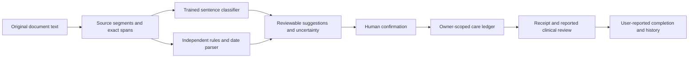

# Looplight

### Give every next step a source, a person, and a recorded ending.

**An AI-assisted UnivaBio 2026 project by Shivam Gupta.**

Looplight helps patients, caregivers, and care coordinators keep track of unfinished care after discharge: a result that is still pending, a repeat test, or a follow-up visit. It extracts **suggestions**, shows the original words, flags missing or conflicting details, and keeps the record open until a person reports what happened.

[Hosted app](https://looplight-shivam.sg127977958.chatgpt.site) · [One-page description](submission/looplight-one-page.pdf) · [Demo script](submission/demo-script.md) · [Pitch deck](submission/looplight-pitch.pptx)

> **Release scope:** working research MVP using fictional or de-identified text. It is not clinically validated, is not a medical decision tool, and is not cleared for production use with identifiable patient records. The hosted Site currently has owner-private access; judge access must be configured before submission. A silent screenshot walkthrough is included as a recording aid; a spoken live demo, user study, patient outcome, or paying customer is not claimed.


## The moment we are building for

Anita is home from hospital. Her daughter Maya has a discharge summary and three unfinished tasks. The obvious one is the next appointment. The quieter ones are the pending culture and the repeat blood count. The document does not say who owns every step or when the pending result should be checked.

Looplight makes that uncertainty visible. It does not interpret the culture or choose treatment. It gives Maya a source-linked record and the questions she needs to ask.

**Why this problem:** a 2005 study of 2,644 patients at two academic hospitals found that 41% had results return after discharge. This is a historical, setting-specific measurement, not a current global rate. Current federal SAFER guidance still addresses test-result reporting and follow-up. [Original study](https://pubmed.ncbi.nlm.nih.gov/16027454/) · [SAFER guides](https://healthit.gov/clinical-quality-and-safety/safer-guides)

## Try it in three minutes

1. Open the demo. All people and records are fictional; demo changes reset on refresh.
2. Choose **Add discharge notes → Anita’s discharge → Find the open loops**. Or import the [text-based sample PDF](public/examples/anita-discharge.pdf).
3. Open the pending blood-culture suggestion. Check the exact source, missing timing/owner flags, and questions for the care team.
4. Name the tracking person, tick the source-review confirmation, and choose **Confirm this follow-up**. Leave uncertain timing blank.
5. In **Record progress**, record receipt of the result. The item remains open.
6. Add the clinician who reviewed it, a note, completion date, and confirmation. Choose **Record completion**. The outcome is visibly **user-reported**.
7. Explore **Source documents** (including omitted/uncertain sentences), **Evidence & AI**, and **Visit brief**.
8. Choose **Sign in for saved spaces** to create an account-scoped, persistent care space.

The **Challenge the AI** example includes conflicting dates, a conditional scan, a negated test, a completed scan, and document text that tries to issue instructions. Nothing in a document can execute code, change a record, or bypass human review.

## What works

| Capability | Behavior |
|---|---|
| Text and PDF import | Paste English text or read embedded-text PDF / `.txt` locally. 5 MB, 20 pages, 40,000 characters. No OCR. Original PDF bytes are not uploaded or retained. |
| Actual trained ML | A reproducible five-category logistic-regression classifier; bundled weights; no model API key or external inference calls. |
| Source provenance | Exact UTF-16 offsets and verbatim text accompany each proposal. All original text stays available. |
| Conservative timing | Date-only arithmetic, supported relative windows, original timing language. Ambiguous formats, multiple timing expressions, unsupported/event-relative dates and likely conflicts require clarification. |
| Human control | Suggestions require confirmation. Add missed actions from source, dismiss incorrect suggestions, edit details, and reopen records. |
| Accountable follow-through | Named tracking person; waiting/received states; a separate named clinical-review requirement for pending results; dated user-reported completion. |
| Persistent care spaces | ChatGPT sign-in, server-side owner checks, Cloudflare D1, immutable source text, append-only event history within a versioned record. |
| Safe updates | Validated commands, same-origin writes, idempotent imports, optimistic concurrency, bounded input/history/record size. |
| Portable outputs | Printable visit brief / save as PDF, text brief, privacy-minimized `.ics` reminders, complete JSON export. |
| Data control | Export and explicitly delete the current care space. No analytics or third-party model transmission. |
| Agent interface | Feature-detected WebMCP tools to read the visible plan and open the import form. No silent confirmation/completion tool. |

## AI: inspectable, bounded, and reproducible



The model classifies sentence topics: follow-up, pending result, medication, safety, or context. It can abstain. Deterministic guards independently handle known wording, exclusions, explicit timing and possible conflicts. This hybrid is intentionally modest; the model does not validate medicine, establish urgency, or replace a clinician.

**Fixed synthetic challenge evaluation:**

| Metric | Result |
|---|---:|
| Original synthetic training sentences | 225 |
| Separately worded held-out synthetic sentences | 50 |
| Raw five-category accuracy | 82% (41/50) |
| Macro F1 | 0.816 |
| Conservative abstentions | 44/50 |
| Accepted predictions | 6/50, all correct; **12% coverage** |

These are **classifier engineering metrics**, not end-to-end extraction recall, real-world accuracy, or clinical outcomes. The same AI-assisted authoring process can introduce shared style across training and challenge data. Thresholds were fixed before evaluation and were not tuned to these challenge examples. Every prediction, including failures, is published in [evaluation.json](ml/evaluation.json). See the [model card](ml/README.md) and [failure analysis](ml/EVALUATION.md).

**Separate document-pipeline evaluation:** an independent author froze 20 original synthetic mini-discharge documents with 44 gold actions before running the then-current engine. Initial version 1.1 proposed 38 actions, 32 correctly typed: **84.2% precision / 72.7% recall**. Its failures informed fixes. Version 1.2 achieves **97.1% precision / 75.0% recall on those same, now-seen regression fixtures** (33 correct of 34 suggestions; 44 gold actions). The improvement is regression evidence, not a fresh generalization claim. Eleven actions still require source review. All 44 gold snippets remain visible; all 16 assigned dates and returned source spans match the annotations.

**No measured ML extraction lift on those 20 documents:** disabling the classifier leaves task outputs unchanged. The trained model can propose sentence categories and some model-only candidates, but this document set does not establish added extraction benefit. The prototype is a rules-led workflow with local ML suggestions. See [initial results, errors and matching rules](ml/pipeline-eval/REPORT.md) and [release regression results](ml/pipeline-eval/release-results.json). Neither evaluation uses clinical records or clinician annotations.

The full document-review experience exists because the model will miss or misclassify instructions. Instructions omitted from the uploaded document cannot be recovered.

## Run locally

Requirements: **Node.js 22.13+**, npm, and Python 3.9+ only if retraining the model. No application API keys are needed.

```sh
npm ci
npm run db:generate
npm run build
npm run db:local
npm run dev
```

Open the Local URL printed by the server (normally `http://localhost:5173`). **Local sign-in is an explicitly local development simulation**, restricted to loopback; it strips caller-supplied identity headers. Hosted sign-in is owned by the Sites dispatcher. Never expose the local development server to the internet.

The bundled migration command applies recorded D1 migrations locally and can safely be rerun. For an existing database, do not delete migration history or run the SQL files blindly.

### Useful commands

```sh
npm run lint               # Source lint checks
npm run typecheck          # Strict TypeScript checks
npm test                   # Extraction, dates, state transitions, exports
npm run test:api            # Running local server + real local D1 integration
npm run test:model          # 64 Python/TypeScript parity and boundary cases
npm run evaluate           # Reproduce runtime classifier counts and local timing
npm run evaluate:pipeline  # Replay the frozen document-level experiment
npm run train:model        # Deterministic Python-standard-library training
npm run build              # Cloudflare-compatible production Worker and client
npm audit --omit=dev        # Runtime dependency audit
```

`npm run test:api` rejects non-local URLs and creates/removes only its own synthetic fixtures. It covers authentication, owner isolation, persistence, idempotency, conflicting edits, input limits, source retention, review/closure gates, same-origin protection, injection, and explicit deletion. It uses the actual local database, not an in-memory mock.

### Stack and repository map

- **UI:** React 19, TypeScript, Vinext/Vite, Lucide icons, native accessible dialogs, responsive CSS.
- **Runtime:** Cloudflare-compatible Worker; logical D1 binding `DB`; Drizzle-generated migrations.
- **Authentication:** bundled dispatch-owned ChatGPT sign-in; no app-stored passwords.
- **ML:** normalized unigram/bigram features, multinomial logistic regression; Python training, TypeScript inference.
- **PDF:** Mozilla PDF.js, dynamically loaded only when needed; disabled `eval` support.

```text
app/                    Pages, API routes, client UI
lib/engine.ts           Segmentation, source spans, rules, proposal generation
lib/dates.ts            Conservative calendar interpretation
lib/commands.ts         Validated state transitions and completion gates
lib/server.ts           Identity, request limits, D1 access, response boundaries
lib/exports.ts          Plain-text brief and calendar file
ml/                     Training data, model weights, inference and evaluation
db/ + drizzle/          Schema and immutable migrations
tests/                  Domain and real local API verification
docs/                   Research, architecture, security, business and QA
submission/             One-page PDF, slides, code PDF, script and submission copy
public/examples/        Fictional PDF/text demo record
```

## Commercial hypothesis

The initial buyer is **one primary-care or transitions coordinator** who currently reconstructs follow-up work from discharge documents. Patients and caregivers are the beneficiaries. A narrow document-first pilot can begin without an EHR integration. Multi-user team collaboration, automated reminders and EHR integrations are future work.

Test a price of **$149/month for 100 episodes**. At an assumed $35/hour loaded staff cost, saving five minutes per episode across 100 episodes represents about $292/month of staff time before review, support, deployment and implementation costs. These are hypotheses, not validated savings or willingness to pay. [Business and pilot plan](docs/BUSINESS.md)

SeamlessMD, Memora/Commure, Eon and Welkin already address overlapping workflows. We do not claim to be the first discharge assistant. Our proposed wedge is the small, source-to-owner-to-reported-resolution record with visible missing details. A reviewed correction dataset and workflow adoption could become defensible assets; neither exists yet. [Research and competitor sources](docs/RESEARCH.md)

## Limits and deployment scope

- **Not for diagnosis, prescribing, result interpretation, triage, or emergency monitoring.** Existing medical instructions remain in the source.
- The extraction system is English-only, incomplete, and not tested on clinical records. Mixed, conditional, negated and unfamiliar language can require manual review.
- “Reported complete” means a person entered a report; it is not EHR-confirmed or independently verified.
- A named tracker is not proof that a clinician accepted responsibility. This MVP has one account per saved care space and no caregiver invitation system.
- The local-only model has zero external inference fees. Hosting, database, support, security, validation and compliance remain real production costs.
- The hosted deployment is currently owner-private. **Judge access is an outstanding submission step.** Do not submit an inaccessible URL.
- Real patient deployment would require an appropriate data-processing arrangement, security/privacy review, clinical governance, external validation, accessible user research, retention and incident-response policies. No regulatory certification or HIPAA compliance is claimed.

See [Security and data handling](docs/SECURITY.md), [Verification record](docs/QA.md), and [Submission checklist](submission/CHECKLIST.md).

## Credits and license

Project creator and submitting participant: **Shivam Gupta**. Built with AI-assisted research, software development, testing, and documentation. The repository and walkthrough are designed so the submitting participant can inspect, understand, modify, and explain the work.

Original project code and synthetic datasets: MIT license. Bundled framework components retain their own notices; PDF.js is Apache-2.0. [License](LICENSE) · [Third-party notices](THIRD-PARTY-NOTICES.md)
