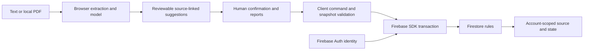

# Architecture

## Current deployment

The default application is a React/TypeScript single-page app built with Vite and served by Firebase Hosting at https://looplight-care.web.app. Firebase Auth supports Google and email/password sign-in. The project uses Cloud Firestore in `asia-south1`. That database region is not a claim that every Firebase service or authentication record is confined to the same region.

The fictional demo runs without sign-in. Saved care spaces are under `/space`. Firebase Hosting rewrites application paths to `index.html`, so refreshing a deep link loads the app.

There is no trusted application backend executing the clinical/workflow state machine in the Firebase path. `firebase/store.ts` adapts the shared interface's request-shaped calls to SDK reads and transactions; `/api/*` strings in that adapter are local dispatch labels, not requests to the old Sites APIs.

## Responsibilities

| Layer | Responsibility and limit |
|---|---|
| `firebase/main.tsx` | Auth state, sign-in UI, saving the current demo copy and workspace selection. |
| `lib/import-file.ts`, `scripts/sync-pdfjs.mjs` | Read embedded PDF text locally with a package-versioned PDF.js module and worker; cap file size, pages and extracted text. No OCR. |
| `lib/engine.ts`, `ml/inference.ts` | Local sentence categories, explicit extraction/date rules and exact source spans. No external model service. |
| `lib/commands.ts` | Client-side command validation, confirmation/receipt/review flow and user-reported event history. |
| `lib/snapshot.ts` | Client-side schema, source-span, identifier, date-range and snapshot consistency checks. |
| `firebase/store.ts` | Owner-path SDK calls, transactions, import retry handling, mutation identifiers, stale-version conflicts and friendly errors. |
| `firebase/firestore.rules` | Server-enforced account path ownership, allowed outer fields, immutable source and selected metadata, version increments, bounds and linked count transactions. |
| `lib/drafts.ts` | Unsaved form fields in a tab-memory map; not durable storage. |
| Export code | Printable/text brief, privacy-minimized calendar reminders and full JSON export. |

## PDF reader delivery

The build hooks copy the installed official PDF.js module, matching worker and Apache-2.0 license into `/vendor/pdfjs/5.4.149/`. The version is read from the installed package rather than duplicated in application code. `lib/import-file.ts` uses a Vite-ignored native import from that stable public path, so an application-only deployment does not invalidate a PDF lazy-chunk URL in an open tab. The previous root worker remains for historical references.

Generated vendor files are ignored by Git and reproduced by `predev`, `prebuild`, `predev:sites` and `prebuild:sites`. A package-version upgrade needs an explicit asset-retention decision for older open tabs; a fresh build does not fetch earlier packages. Failed module/worker loads show a retry message and retain the current form content. The app does not reload the page automatically. The retry requests a fresh URL query to avoid a cached failed import.

## Data layout

`users/{uid}` contains the care-space count and the transaction's mutation kind/id and server update timestamp. `users/{uid}/episodes/{id}` contains:

- `source`: JSON string holding patient display name, document title, discharge date, original text, source sentences and engine version.
- `state`: JSON string holding the episode id, loops, user-reported history, version and client timestamps.
- `version`, `patientName`, `documentTitle`, `createdAt`: outer fields used for validation/listing.
- `updatedAt`: Firestore server timestamp for the record write.
- `lastMutationId`: retry identifier.

The rules keep `source`, display-name/title metadata and `createdAt` unchanged after creation. Revised source requires a new care space. The source is still user-supplied at creation; immutability does not authenticate the document's author or truth.

The rules do not parse the embedded source/state JSON. They cannot verify that a source quote matches, a report was appended honestly, a reviewer is real or a workflow transition followed the UI. Those are client-side checks and user assertions. An owner using a custom client can replace mutable state within the outer rule constraints. **History is not a trusted or tamper-proof clinical audit log.**

## Transactions and retry behavior

- Creation analyzes locally, validates the result and uses an import UUID. The transaction creates the episode and increments the account count together. A repeated matching import id returns its existing record; conflicting source details are rejected by the app.
- **Save this care space** clones the current demo's source, follow-ups and edits under a new saved-space id. It starts storage version 1 while retaining the existing user-reported history. It does not relabel fictional demo activity as verified account activity.
- Updates read the current record in a Firestore transaction, check the observed version, apply the client command and write version + 1. The rules independently require the increment. A repeated last-mutation id returns the saved result in the normal client path.
- A stale edit raises a conflict. The UI loads the latest saved state and retains unfinished form inputs for the person to review before retrying.
- Deletion checks typed `DELETE` and the current version in client code, then deletes the record and decrements the count in one transaction. The rules require the linked count change, but do not enforce the UI's typed confirmation or client-version check for deletes.

These mechanisms prevent common accidental duplicates and lost updates through the normal app. They do not establish exactly-once delivery across every restart or an immutable history of owner actions.

## Workflow meaning

Suggestions become active after source confirmation and a named tracking person. Active actions can wait for a reply. A pending result records receipt before the UI allows reported completion with a named clinician, note and date. Actions can be dismissed or reopened with a reason.

Receipt, clinician review, dates and completion are user-reported. A named tracker is not an accepted clinical handoff. The app does not fetch lab results or obtain clinician signatures. `updatedAt` is a trusted storage-write timestamp, not proof of when a clinical event occurred.

## Bounds and availability

- Import: 5 MB file, 20 PDF pages and 40,000 extracted characters.
- Engine/client: at most 100 automatic proposals and 100 loops per space, 1,000 events, and strict snapshot fields/spans.
- Snapshot client: serialized episode length at most 880,000 characters; decode rejects combined source/state strings above 900,000.
- Firestore rules: source/state string-size sum at most 900,000, outer version 1 through 1001, and at most 100 stored care spaces per account through linked count writes. String-length checks are not a promise about encoded byte size; Firestore also has its own document limits.
- Firestore reads request server data. Transactions require connectivity. No offline synchronization is promised.

The record cache uses `memoryLocalCache()`. Form drafts remain when a form closes and reopens within the same running tab. Refreshing or closing the tab discards unsaved drafts; the app's sign-out action clears them. Firebase Auth may persist sign-in separately. Exported files are user-controlled copies.

## Historical implementation

`app/api/*`, `app/chatgpt-auth.ts`, `lib/server.ts`, `db/`, `drizzle/` and the Sites build helpers retain the earlier Cloudflare D1 implementation for reproducibility. `dev:sites`, `build:sites`, `start:sites`, `db:*` and `test:api` refer to that path. Their server-side command checks and identity-header assumptions are not the Firebase deployment architecture.

## Verified engineering evidence

On September 15, 2026, the deployed Firebase adapter/rules rerun passed **57/57 checks**. The full local Auth/Firestore emulator run passed **58/58**, including actual saturation at the 100-space cap. They covered anonymous denial, two-account read/list/write/delete isolation, CRUD/reload, duplicate import, same-session lost-success replay, concurrent/stale versions, immutable source metadata, linked quota transactions, malformed/oversized writes and cleanup. The initial deployed run passed 56/58 and is retained with its two recovery failures. Its cap test passed; the smaller deployed rerun did not repeat saturation.

The domain suite passed **31 tests**, snapshot/export suite **16**, and Python/TypeScript model parity **64 cases**. Commands and sanitized reports are linked from [QA](QA.md) and [Firebase test instructions](../tests/firebase/README.md). Each retained integration report records the source hashes it tested. Those hashes identify that run, not every later presentation or error-message change.

Release-owner browser checks verified Google sign-in, saving an edited demo and full reload; importing the bundled text PDF into three follow-ups; preserving drafts across form close/reopen; source-linked manual addition; receipt before reported clinician closure; and real OS downloads. The downloaded JSON decoded as a valid snapshot with 21 source segments and three loops. Text/calendar contents were inspected. The release owner also passed the final PDF-import retest and the adjusted two-page print output. Calendar-app import and a physical printer remain unverified.

These tests establish bounded engineering behavior. They do not validate clinical correctness, prove comprehensive security or promise recovery of unsaved drafts after refresh.
