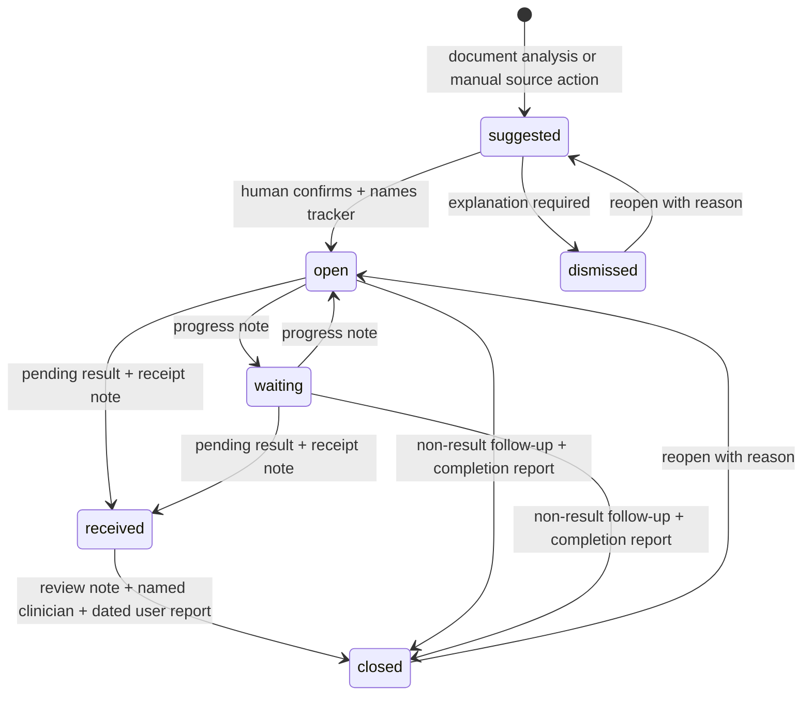

# Architecture

## Boundaries

The app has an ephemeral fictional demo (`/`) and a saved account-scoped workspace (`/space`). Demo interaction runs the same domain engine/commands in the browser, but explicitly resets on refresh. Authoritative saved data lives in D1 and changes only through server-validated commands.

| Boundary | Responsibility |
|---|---|
| Browser import | Read PDF bytes locally with PDF.js; show extracted text for review; cap file size/pages/text. |
| Server authentication | Accept identity only from the trusted Sites dispatcher in production; require sign-in for every data API. |
| Request boundary | Same-origin JSON, bounded streaming body, strict input schemas. |
| ML | Classify a source segment; never execute document instructions or call another model. |
| Domain engine | Retain source, split clear clauses, label unknown/mixed text, derive limited dates, propose with provenance. |
| Human review | Confirm, correct, dismiss, or add a missed follow-up from source. |
| State machine | Enforce ownership fields and legal transitions; require receipt and a named reviewer for pending-result closure. |
| Database | Owner-scoped prepared statements; versioned JSON record; atomic compare-and-swap updates. |
| Export | Printable/readable brief, minimal calendar reminders, full portable JSON. |

## Data model

`episodes` contains id, owner_id, patient_name, document_title, state JSON, version, created_at and updated_at. `(owner_id, updated_at)` is indexed for account lists. Source text, sentence spans, suggestions, confirmed fields and events live in one bounded JSON record so the plan and its history update atomically. This is an MVP tradeoff: source/action tables and separate immutable audit storage would be more suitable for larger collaborative deployments.

No runtime schema mutation occurs. Drizzle emits schema-only SQL; Sites applies deployment migrations. Local migration application uses Wrangler’s recorded migration table.

## Update semantics

- Creation requires an `Idempotency-Key` UUID. A repeated request with the same source returns the existing record. A different payload with that key fails.
- Every update sends the last observed `version`. The server rechecks ownership, validates the command, applies its rules, and performs `UPDATE ... WHERE owner_id = ? AND version = ?`.
- Only one of two simultaneous updates can win. The other returns HTTP 409 and the UI preserves the open form.
- The client does not provide trusted source spans, event history, actor identity, or arbitrary replacement JSON.
- The source remains immutable. Edits record prior title/owner/date fields in history. Source timing wording/flags remain as evidence about the original document.
- Deletion requires the current version and typed `DELETE` confirmation in the product UI.

## State transitions

A result is never closed automatically. Reported review is a user assertion, not a verified clinician signature or EHR event.

## Conservative date interpretation

Supported: ISO date; month-name date with year in either order; `in N days/weeks`; `within N days/weeks`; supported numeric/word ranges. Relative dates reference the entered discharge day and preserve the original wording. All arithmetic uses date-only UTC values so timezone/DST shifts do not move reminders.

Unsupported or ambiguous: numeric locale formats, months/hours/business days, vague weekdays/soon, yearless named dates, open-ended `after`, another event as anchor, multiple timing phrases, and likely conflicting instructions. These yield no invented date and remain editable after clarification. Calendar export uses the last day of a confirmed window and does not represent a booked appointment.

## Bounded operation

- Files ≤5 MB, PDFs ≤20 pages, extracted text ≤40,000 characters.
- Streaming JSON request ≤180,000 bytes.
- At most 100 automatic proposals, with excess source explicitly marked for manual review.
- At most 100 care spaces per account and 100 follow-ups per space.
- History ≤1,000 events; serialized state ≤900,000 bytes.
- No external network call during model inference; approximately 170 KB model JSON, about 50 KB gzip.

## Deployment trust assumption

Production runs behind the Sites dispatcher, which supplies authenticated identity headers. Do not expose the Worker directly on an origin where callers can forge those headers. The local Vite plugin removes forged identity headers and offers a loopback-only test sign-in. `npm run start` is a low-level built-Worker preview, not a replacement for a production authentication gateway.
